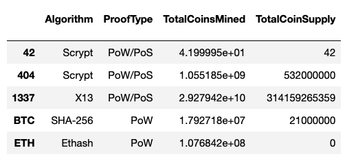
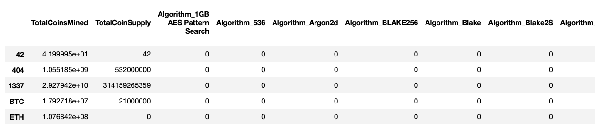
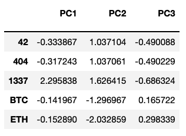
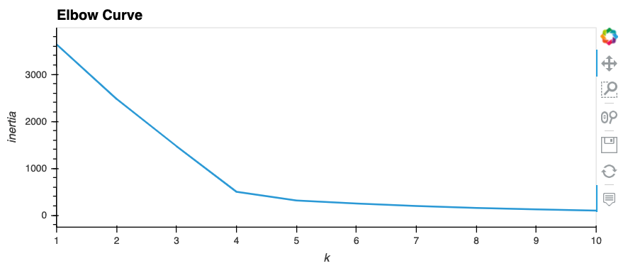
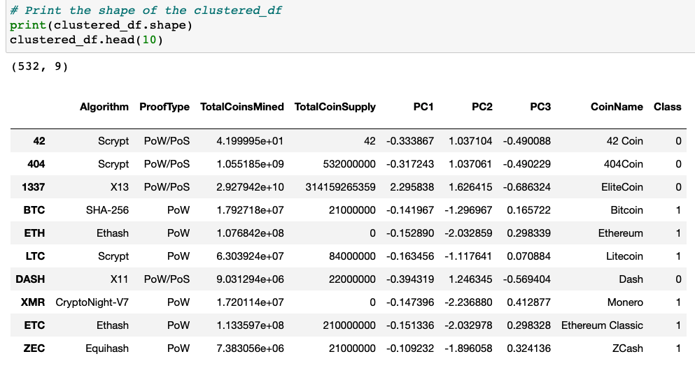
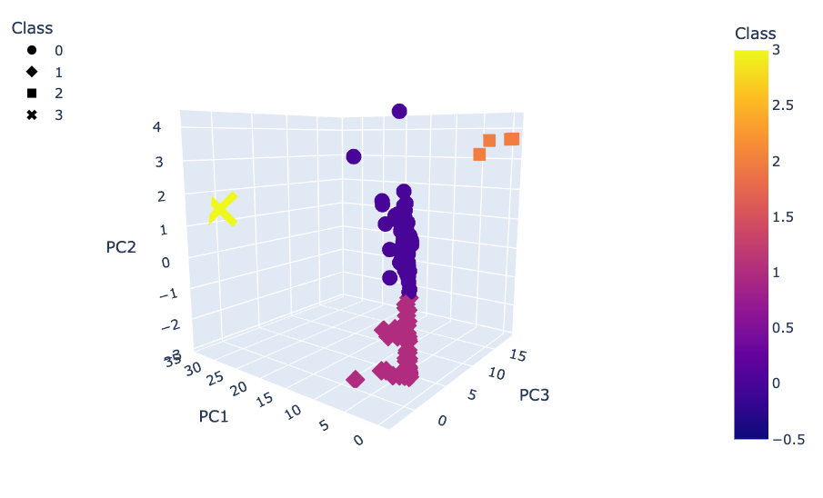
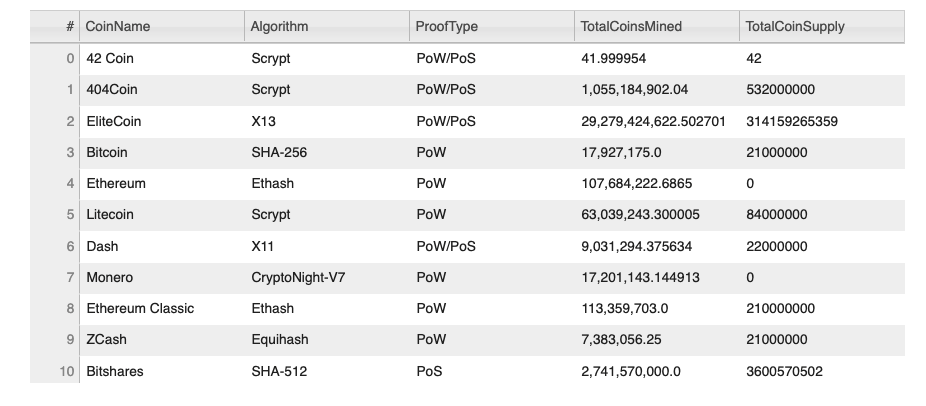
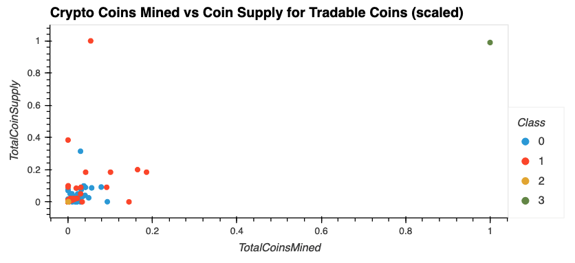

# Cryptocurrencies
Using unsupervised Machine Learning algorithms to look for trends in data

Using Python, Pandas, sci-kit learn, and hvPlot to preprocess a dataset, transform the data, explore trends in the data, and create data visualizations to display those trends. 

## Overview
The purpose of this project was to analyze  trends in cryptocurrency data using unsupervised machine learning and then visualizing the data using various plotting tools. More specifically, the investigation sought to identify which  cryptocurrencies are currently on the trading market and how they could be grouped to create a classification system.

## Resources
Python
Pandas
sci-kit learn
plotly
hvPlot

# Results
The following processes were performed to transform, analyze, and display  the data. A file of 1252 cryptocurrencies with 7 descriptive columns was cleaned by eliminating currencies that were not currently trading, did not have a working algorithm, or had missing data. Then the data was encoded and scaled to prepare for the unsupervised machine learning algorithms to be applied. 

Figure 1. Cleaned Cryptocurrency DataFrame

Figure 2. Encoding with get_dummies

After encoding with get_dummies and scaling the data with sci-kit learn StandardScaler, a feature reduction process using Principal Component Analysis (PCA) was completed to simplify the dataset for the machine learning algorithm. 

Figure 3. PCA Reduction to Three Features

Next, cryptocurrency clusters were investigated using K-Means. The inertia values for a range of k values were calculated and the ElbowCurve was plotted. As can be seen in Figure 4, an inflection point appeared evident at k = 4.

Figure 4. Elbow Curve Plot

The K-Means model was built with four clusters to investigate the class grouping trends. Also, a new dataframe was created to hold the cleaned data, the PCA data, the Coin names, and Class group numbers (Figure 5). As can be seen, 532 cryptocurrencies were found to be tradable from the original list of 1252. Next, the PCA data and clusters were plotted in a 3D Scatter Plot using PlotlyExpress (Figure 6) to visualize the grouping trends. 

Figure 5. Clustered Cryptocurrency DataFrame

Figure 6. 3D Scatter Plot of Clustered Cryptocurrencies

Next, an interactive table was created with hvPlot to display select feature columns that could be easily filtered.

Figure 7. Interactive Data Table

Lastly, the total coins mined versus the total supply of coins available was plotted for each of the cryptocurrencies in a 2D scatterplot. 

 Figure 8. Scaled Scatter Plot of Coin Mining and Supplies

# Summary
The following highlights were discovered through this analysis. First, of the 1252 cryptocurrencies listed in the dataset, 532 were identified as currently being tradable. Second, among these currencies, it appears that there may be four potential grouping characteristics within the three PCA features. Further analysis will be required to identify which cryptocurrency features contributed to those PCA features. 
